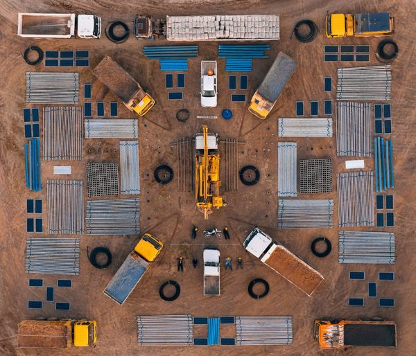
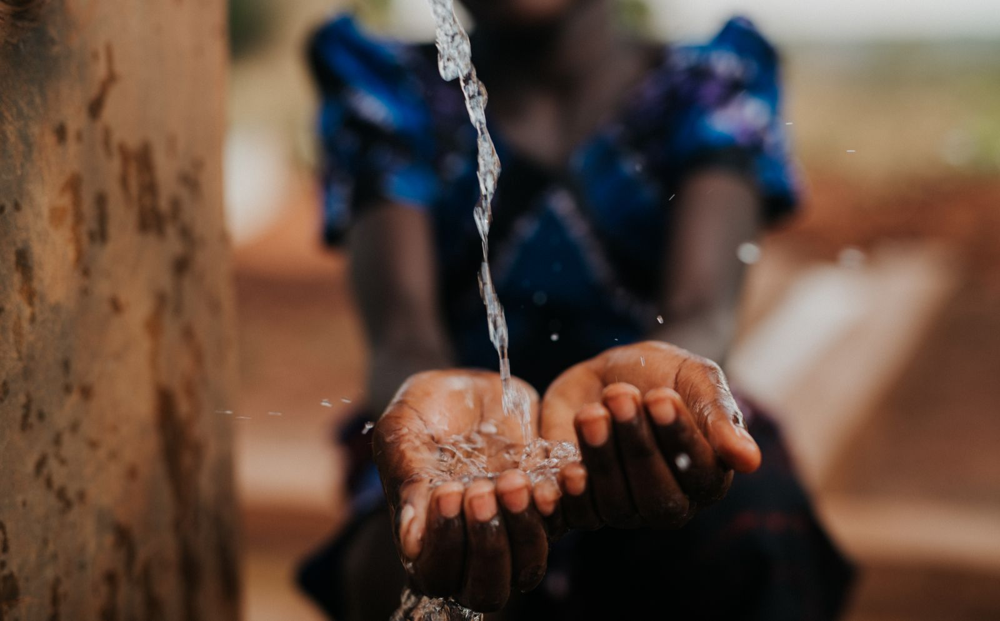

<!DOCTYPE html>
<html lang="en">
<head>
  <meta charset="UTF-8">
  <meta name="viewport" content="width=device-width, initial-scale=1.0">
  <title>Charity: Water - End the Water Crisis</title>
  
</head>
<body>

  <header>
    
    <nav>
      <ul>
        <li><a href="#">Home</a></li>
        <li><a href="#">Our Work</a></li>
        <li><a href="#">Stories</a></li>
        <li><a href="#">Contact</a></li>
      </ul>
    </nav>
  </header>

  <section class="hero">
    

      <h2>Together, We Can End the Water Crisis</h2>
      
Since 2006, we’ve been working to ensure everyone has access to life’s most basic need. With your help, it can happen in our lifetime.

      <a href="#" class="btn">Donate Now</a>
    

  </section>

  <section class="impact">
    

      <h3>186,000+</h3>
      
Water projects funded worldwide

    

    

      <h3>29</h3>
      
Countries served with clean water

    

    

      <h3>20M+</h3>
      
People gaining access to clean water

    

  </section>

  <section class="section">
    <h2>Why Water?</h2>
    
Clean water changes everything. It improves health, keeps kids in school, supports economic growth, and empowers women and girls.

    <a href="#" class="btn">See Stories of Change</a>
    

      

        
        

          <h3>Hope in Ethiopia</h3>
          
A new well transformed life for hundreds of families, giving them clean water close to home.

        

      

      

        
        

          <h3>Clean Water for Kids</h3>
          
Children no longer walk miles each day, and now have time to attend school and play.

        

      

      

        
        

          <h3>Empowered Communities</h3>
          
Women lead water committees to maintain wells, ensuring sustainability for generations.

        

      

    

  </section>

  <section class="section">
    <h2>100% Model</h2>
    
We promise that 100% of your donation goes directly to clean water projects. Private donors fund our operations so every dollar you give helps people in need.

  </section>

  <footer>
    
© 2025 charity: water — Ending the global water crisis together

  </footer>

</body>
</html>
